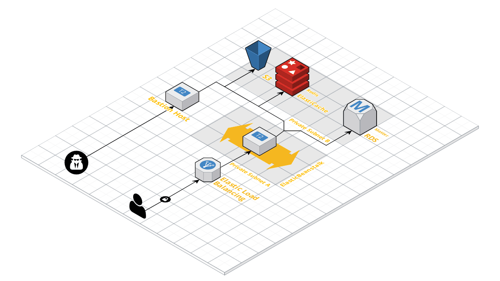

# Hal Terraform Modules

Infrastructure as Code Terraform modules for hosting Hal in AWS

## Hal Frontend Test Infastructure



## Getting Started

### Requirements

#### 1. Terrafrom
- `brew install terraform`

#### 2. AWS Account subnets and vpc-id's

This terraform setup is a BYON (Bring your own network) setup and does not create any networking or vpc resources for you. You should have at *minimum* before this:

- **vpc**
- **public subnets**
- **private subnets**

## How to use these modules

Each component sets up a different piece of Hal's infastructure. See the `README.md` in each module for a description of that modules configuration. These modules should be run in order:

- [bastion](bastion)
- [database](database)
- [frontend](frontend)

### Terragrunt Recommendation

[Terragrunt](https://github.com/gruntwork-io/terragrunt) is a thin wrapper around terraform that helps keep configuration and module definition seperate. We recommend using terragrunt to manage your hal environments without needing to change this repo. Below is some example terragrunt configuration:

#### Bastion Host Example

```hcl
terragrunt = {
  terraform = {
    source = "github.com/hal-platform/terraform-modules//bastion"
  }

  include = {
    path = "${find_in_parent_folders()}"
  }
}

vpc_id = "vpc-xxxxxx"

aws_region = "us-east-2"

prefix = "hal-xxxx"

iac_tags = {
  iac = "terraform"
}

subnet_id = "subnet-yyyyyy"

allowed_ips = ["0.0.0.0/0"]

ssh_key_name = "xxxx-keypair"

instance_type = "t2.micro"

zone_name = "hal.xxxx.zone"

```

#### Frontend Example

```hcl
terragrunt = {
  terraform {
    source = "github.com/hal-platform/terraform-modules//frontend"
  }

  include = {
    path = "${find_in_parent_folders()}"
  }
}

vpc_id = "vpc-xxxxxxx"

aws_region = "us-east-2"

application_name = "yyyyyy"

application_id = "zzzzzzzzzz"

environment_name = "nonprod"

beanstalk_tier = "web"

instance_type = "t2.micro"

subnets_private_instances = ["subnet-xxxxxxx", "subnet-zzzzzzz"]

subnets_public_load_balancer = ["subnet-yyyyyyyy", "subnet-wwwwwww"]

load_balancer_visibility = "external"

load_balancer_allowed_incoming_ip_or_sg = ["0.0.0.0/0"]

ssh_keypair_name = "xxxxxxx"
```

#### Database Example

```hcl
terragrunt = {
  terraform {
    source = "github.com/hal-platform/terraform-modules//database"
  }

  include = {
    path = "${find_in_parent_folders()}"
  }
}

prefix = "bnagi"

vpc_id = "vpc-xxxxxx"

aws_region = "us-east-2"

# RDS
rds_subnet_ids = ["subnet-xxxxxx", "subnet-yyyyyyy"]

rds_instance_type = "db.t2.small"

rds_master_username = "hal"

rds_master_password = "CHANGEME!!!!"

rds_instance_type = "db.r4.large"

rds_backup_retention_days = "14"

rds_allowed_security_groups = ["sg-wwwwwww, "sg-zzzzzzzz"]

# ElastiCache
cache_allowed_security_groups = ["sg-wwwwwww, "sg-zzzzzzzz"]

cache_subnet_ids = ["subnet-ppppppppp"]
```
