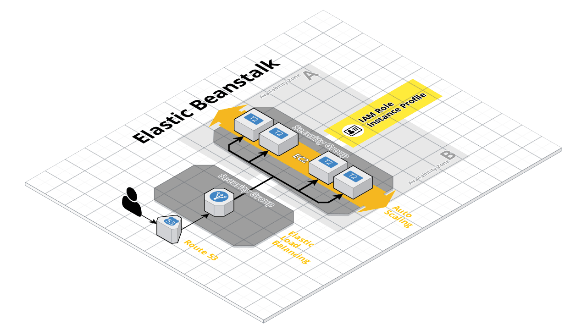

# Frontend UI/API

This module is for setting up the UI/API beanstalk application for Hal.

## Output

Make sure to make note of the `EC2: <security_group_id>` output as you will need to use this in the database `allowed_security_groups` variables list.

## Configuration

To configure the cluster that terraform will create, simply fill out the terraform.tfvars file.
The following are all required vars unless specified with defaults:

| Var                                      | Description
| ---------------------------------------- | -----------
| aws_region                               | Region where instances get created
| ---                                      | ---
| application_name                         | Name for the application
| application_id                           | A unique application ID (such as Core ID)
| environment_name                         | Application environment such as `dev` or `prod`
| ---                                      | ---
| beanstalk_platform                       | Defaults to `php7`
| beanstalk_tier                           | Defaults to `web`
| instance_type                            | Defaults to `t2.micro`
| custom_beanstalk_platform                | Only use if you want to customize exact solution stack
| ssh_keypair_name                         | Optional
| ---                                      | ---
| healthcheck_path                         | Defaults to `/`
| ssl_certificate_arn                      | Optional
| ---                                      | ---
| deploying_policy                         | Defaults to `AllAtOnce`
| rolling_update_max_batch_size            | Defaults to `1`
| ---                                      | ---
| asg_min_instances                        | Defaults to `1`
| asg_max_instances                        | Defaults to `3`
| asg_trigger_lower_threshold              | Defaults to `20`
| asg_trigger_higher_threshold             | Defaults to `80`
| ---                                      | ---
| vpc_id                                   | VPC ID
| subnets_private_instances                | Public subnets for ALB (specify at least 2)
| subnets_public_load_balancer             | Private subnets for ASG (specify at least 2)
| load_balancer_visibility                 | Defaults to `internal`
| load_balancer_allowed_incoming_ip_or_sg  | Defaults to `0.0.0.0/0`
| load_balancer_additional_sg              | Optional.
| ---                                      | ---
| dns_zone_name                            | Optional. Enter to create DNS record.
